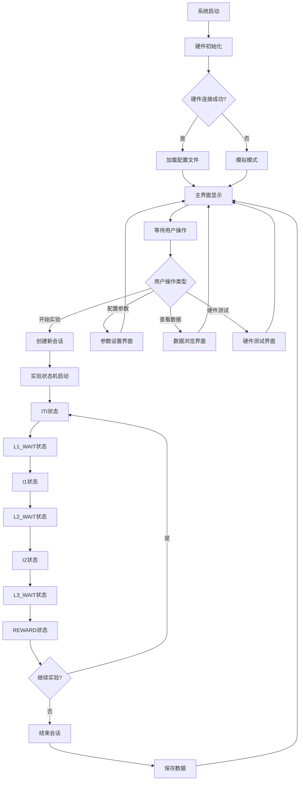
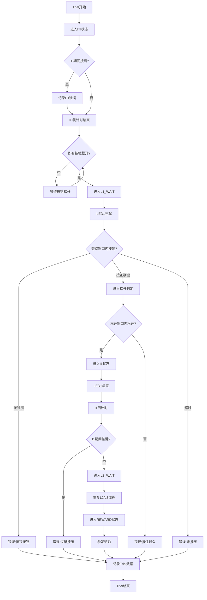
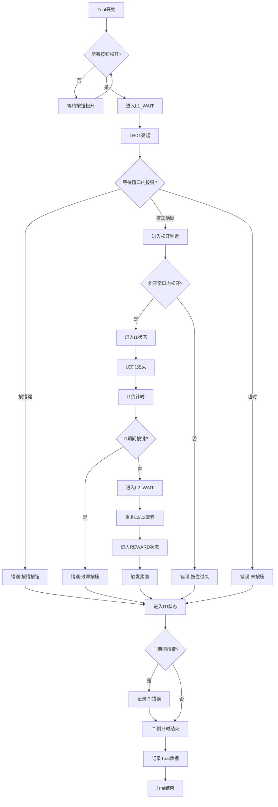
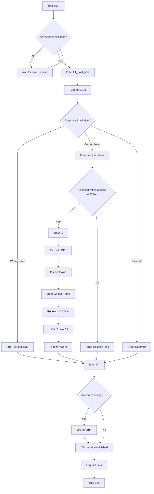

# MATLAB移植项目产品需求文档

## 1. 产品概述

将现有Python三键序列小鼠训练任务完整移植到MATLAB平台，集成Arduino Due硬件控制，提供专业的行为学实验解决方案。移植后的系统将严格对齐原项目的实验逻辑、时序精度和数据记录规范，同时提供更好的MATLAB生态集成和硬件控制能力。

本产品解决了行为学实验中对高精度时序控制、实时数据记录和硬件集成的需求，为研究人员提供可靠、易用的实验平台。产品目标是成为行为学实验领域的标准MATLAB解决方案。

## 2. 核心功能

### 2.1 用户角色

| 角色 | 使用方式 | 核心权限 |
|------|----------|----------|
| 实验研究员 | 直接操作MATLAB界面 | 可配置实验参数、执行实验、查看实时数据 |
| 实验室管理员 | 系统配置和维护 | 可修改系统配置、管理数据文件、硬件维护 |
| 数据分析师 | 访问实验数据 | 可读取JSON/CSV数据文件、进行后续分析 |

### 2.2 功能模块

本MATLAB移植项目包含以下主要页面和模块：

1. **主实验界面**：实时状态显示、LED指示器、试次结果条带、统计面板、参数显示区域
2. **配置管理界面**：参数设置、配置文件加载保存、硬件设置
3. **数据查看界面**：实验数据浏览、统计图表、导出功能
4. **硬件测试界面**：Arduino连接测试、LED/按钮/电磁阀功能测试
5. **帮助文档界面**：操作说明、快捷键指南、故障排除

### 2.3 页面详细功能

| 页面名称 | 模块名称 | 功能描述 |
|----------|----------|----------|
| 主实验界面 | 会话信息区 | 显示被试ID、会话标签、当前模式（Sequence-3/Shaping-1） |
| 主实验界面 | 状态显示区 | 实时显示当前状态、倒计时、试次进度（当前/总数） |
| 主实验界面 | LED指示器 | 同步显示硬件LED状态，支持L1/L2/L3/奖励四个指示灯 |
| 主实验界面 | 结果条带 | 滚动显示最近30个trial结果，用颜色区分正确(绿)和错误类型 |
| 主实验界面 | 统计面板 | 实时统计总试次、正确率、各类错误数量、ITI错误计数 |
| 主实验界面 | 参数显示 | 显示当前等待时间、间隔时间、松开窗口、ITI参数 |
| 主实验界面 | 控制按钮 | 开始/暂停、重置、模式切换、帮助、保存配置功能 |
| 配置管理界面 | 基础参数设置 | 配置等待时间、间隔时间、松开窗口、ITI参数等核心参数 |
| 配置管理界面 | 自适应设置 | 配置自适应算法参数：窗口大小、阈值、调整步长等 |
| 配置管理界面 | 硬件配置 | 设置Arduino端口、引脚映射、消抖时间等硬件参数 |
| 配置管理界面 | 会话设置 | 配置被试ID、会话标签、最大试次数等会话参数 |
| 数据查看界面 | 数据浏览器 | 浏览历史会话数据、查看trial详情、搜索过滤功能 |
| 数据查看界面 | 统计图表 | 显示正确率趋势、反应时间分布、错误类型统计等图表 |
| 数据查看界面 | 数据导出 | 导出CSV/Excel格式数据、生成统计报告 |
| 硬件测试界面 | 连接测试 | 检测Arduino连接状态、串口通信测试 |
| 硬件测试界面 | 功能测试 | 单独测试LED、按钮、电磁阀功能，验证硬件工作状态 |
| 硬件测试界面 | 校准工具 | 时序校准、按钮灵敏度调整、消抖参数优化 |
| 帮助文档界面 | 操作指南 | 详细的操作步骤说明、实验流程介绍 |
| 帮助文档界面 | 快捷键说明 | 所有快捷键功能说明、热键操作指南 |
| 帮助文档界面 | 故障排除 | 常见问题解答、错误代码说明、解决方案 |

## 3. 核心流程

### 3.1 主要用户操作流程

**实验研究员流程**：
1. 启动MATLAB应用 → 2. 配置实验参数 → 3. 连接Arduino硬件 → 4. 运行硬件自检 → 5. 开始实验会话 → 6. 实时监控实验进度 → 7. 处理实验中的异常情况 → 8. 结束会话并保存数据 → 9. 查看实验结果统计

**实验室管理员流程**：
1. 系统初始化设置 → 2. 硬件连接配置 → 3. 默认参数设置 → 4. 用户权限管理 → 5. 定期数据备份 → 6. 硬件维护检查 → 7. 系统性能监控

**数据分析师流程**：
1. 访问数据目录 → 2. 加载实验数据文件 → 3. 数据预处理和清洗 → 4. 统计分析和可视化 → 5. 生成分析报告 → 6. 导出结果数据

### 3.2 系统状态流程图

### 3.3 实验试次流程图

## 4. 用户界面设计

### 4.1 设计风格

- **主色调**：深蓝色(#1f4e79)作为主色，浅灰色(#f8f9fa)作为背景色
- **辅助色**：绿色(#28a745)表示正确，红色(#dc3545)表示错误，橙色(#fd7e14)表示警告
- **按钮风格**：圆角矩形按钮，3D效果，悬停时颜色加深
- **字体**：主要使用Arial字体，大小12-16pt，重要信息使用粗体
- **布局风格**：网格化布局，模块化设计，清晰的视觉层次
- **图标风格**：简洁的线性图标，统一的视觉风格，支持高DPI显示

### 4.2 页面设计概览

| 页面名称 | 模块名称 | UI元素 |
|----------|----------|--------|
| 主实验界面 | 顶部信息栏 | 被试ID标签、会话时间显示、模式切换按钮，背景色#e9ecef |
| 主实验界面 | 状态显示区 | 大字体状态文本(24pt粗体)、圆形倒计时进度条、试次计数器 |
| 主实验界面 | LED指示面板 | 四个圆形LED指示器(直径60px)，亮起时发光效果，标签L1/L2/L3/R |
| 主实验界面 | 结果条带 | 30个小方块(20x20px)，颜色编码：绿色(0)、红色(1-4)，滚动动画 |
| 主实验界面 | 统计面板 | 表格形式显示，交替行背景色，数值右对齐，百分比显示 |
| 主实验界面 | 参数显示区 | 卡片式布局，参数名称加粗，数值高亮显示，单位标注 |
| 主实验界面 | 控制按钮区 | 大按钮(120x40px)，图标+文字，颜色区分功能类型 |
| 配置管理界面 | 参数输入区 | 标签化输入框，数值验证，单位下拉选择，实时预览 |
| 配置管理界面 | 配置文件区 | 文件浏览器样式，加载/保存按钮，配置历史列表 |
| 数据查看界面 | 数据表格 | 可排序表格，分页显示，搜索过滤框，导出按钮 |
| 数据查看界面 | 图表区域 | 交互式图表，缩放功能，图例说明，导出图片功能 |
| 硬件测试界面 | 连接状态区 | 状态指示灯，连接信息显示，重连按钮，端口选择下拉框 |
| 硬件测试界面 | 测试控制区 | 测试按钮网格，实时反馈显示，测试结果日志 |

### 4.3 响应式设计

本产品主要面向桌面MATLAB环境，采用桌面优先的设计策略：
- **最小分辨率**：1024x768像素
- **推荐分辨率**：1920x1080像素或更高
- **界面缩放**：支持Windows系统DPI缩放
- **窗口调整**：支持窗口大小调整，关键信息优先显示
- **多显示器**：支持多显示器扩展，可将数据显示分离到第二屏幕

## 5. 技术规格要求

### 5.1 性能要求
- **时序精度**：按键检测精度≤2ms，状态转换延迟≤1ms
- **数据处理**：支持连续运行8小时以上，内存占用≤500MB
- **响应时间**：UI响应时间≤100ms，硬件控制响应≤10ms
- **数据吞吐**：支持每秒100次以上的事件记录

### 5.2 兼容性要求
- **MATLAB版本**：支持R2019b及以上版本
- **操作系统**：Windows 10/11，macOS 10.14+，Ubuntu 18.04+
- **硬件平台**：Arduino Due，兼容Arduino Mega2560
- **文件格式**：JSON、CSV、MAT文件格式支持

### 5.3 可靠性要求
- **数据安全**：实时数据备份，异常情况下数据不丢失
- **错误恢复**：硬件连接中断后自动重连，实验状态恢复
- **异常处理**：所有异常情况都有明确的错误提示和处理方案
- **长期稳定性**：支持连续运行24小时以上不出现内存泄漏

### 5.4 安全性要求
- **数据保护**：实验数据加密存储，防止意外修改
- **访问控制**：配置文件写保护，防止误操作
- **硬件保护**：电磁阀过载保护，LED过流保护
- **系统安全**：定期自检，异常状态自动安全关闭

## 6. 验收标准

### 6.1 功能验收
- ✅ 完整实现Sequence-3和Shaping-1两种实验模式
- ✅ 精确实现松开判定逻辑，包括双重时间窗口机制
- ✅ 完整的错误编码系统（0-4五种结果类型）
- ✅ 实时数据记录，JSON和CSV格式完全对齐原版
- ✅ 自适应算法正确实现，参数调整逻辑准确
- ✅ ITI错误处理符合规范，独立计数不影响正确率

### 6.2 性能验收
- ✅ 时序精度测试：按键响应时间≤2ms
- ✅ 长期稳定性测试：连续运行8小时无异常
- ✅ 数据完整性测试：1000个trial数据记录无丢失
- ✅ 硬件兼容性测试：Arduino Due和Mega2560都能正常工作

### 6.3 用户体验验收
- ✅ 界面响应流畅，操作直观易懂
- ✅ 错误提示清晰，帮助文档完整
- ✅ 配置管理方便，参数调整实时生效
- ✅ 数据查看功能完善，支持多种分析视图

### 6.4 文档验收
- ✅ 完整的用户操作手册
- ✅ 详细的硬件连接说明
- ✅ 全面的API文档和代码注释
- ✅ 故障排除指南和常见问题解答

---

**文档版本**：v1.0  
**创建日期**：2024年1月  
**审核状态**：待审核  
**负责人**：行为学实验工程师 + MATLAB工程师