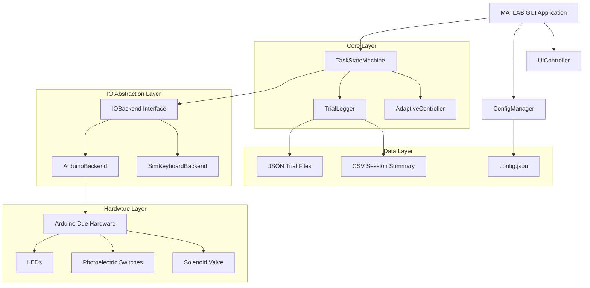

# MATLAB移植项目技术架构文档

## 1. 项目概述

本文档详细规划将现有Python三键序列小鼠训练任务完整移植到MATLAB平台，并集成Arduino Due硬件控制。移植后的系统将严格对齐原项目的实验逻辑、时序精度和数据记录规范。

### 1.1 移植目标
- **功能对等性**：完全复刻原Python项目的所有核心功能
- **时序精度**：保证毫秒级时序控制和判定精度
- **数据一致性**：确保数据记录格式与原版完全兼容
- **硬件集成**：通过Arduino Due实现真实硬件控制
- **可扩展性**：预留未来硬件升级和功能扩展接口

### 1.2 技术栈选择
- **前端界面**：MATLAB App Designer或传统MATLAB GUI
- **硬件通信**：MATLAB Support Package for Arduino
- **数据存储**：JSON文件（trial级）+ CSV文件（session级）
- **配置管理**：JSON配置文件
- **时序控制**：MATLAB高精度计时器

## 2. 系统架构设计

### 2.1 整体架构图



### 2.2 模块化设计原则

1. **状态机核心**：独立的FSM逻辑，与IO和UI解耦
2. **IO抽象层**：支持Arduino和模拟后端的可切换接口
3. **配置管理**：集中化参数管理和热加载机制
4. **数据记录**：实时、安全的数据持久化
5. **自适应控制**：基于性能的动态参数调整

## 3. 核心组件详细设计

### 3.1 状态机设计（+core/TaskStateMachine.m）

#### 3.1.1 状态枚举
```matlab
classdef TaskState < uint8
    enumeration
        ITI (1)
        L1_WAIT (2)
        I1 (3)
        L2_WAIT (4)
        I2 (5)
        L3_WAIT (6)
        REWARD (7)
        SHAPING_WAIT (8)
        PAUSED (9)
        FINISHED (10)
    end
end
```

#### 3.1.2 状态转换逻辑
- **Sequence-3模式**：ITI → L1_WAIT → I1 → L2_WAIT → I2 → L3_WAIT → REWARD → ITI
- **Shaping-1模式**：ITI → SHAPING_WAIT → REWARD → ITI
- **错误处理**：任何错误立即转入ITI（错误ITI）

#### 3.1.3 关键方法设计
```matlab
classdef TaskStateMachine < handle
    methods
        function obj = TaskStateMachine(config, ioBackend, logger)
        function enterState(obj, newState)
        function update(obj, currentTime, events)
        function processKeyEvent(obj, event)
        function startNewTrial(obj)
        function endTrial(obj, resultCode, resultText)
    end
end
```

### 3.2 IO抽象层设计

#### 3.2.1 接口定义（+io/IOBackend.m）
```matlab
classdef (Abstract) IOBackend < handle
    methods (Abstract)
        setLED(obj, ledIndex, state)  % 控制LED状态
        buttonState = readButton(obj, buttonIndex)  % 读取按钮状态
        triggerReward(obj, duration)  % 触发奖励
        events = processEvents(obj)  % 处理输入事件
        success = initialize(obj)  % 初始化硬件
        cleanup(obj)  % 清理资源
    end
end
```

#### 3.2.2 Arduino后端实现（+io/ArduinoBackend.m）
```matlab
classdef ArduinoBackend < io.IOBackend
    properties (Access = private)
        arduino  % Arduino对象
        ledPins = [22, 23, 24]  % LED引脚
        buttonPins = [30, 31, 32]  % 按钮引脚
        valvePin = 26  % 电磁阀引脚
        lastButtonStates  % 按钮状态缓存
        debounceTime = 0.01  % 消抖时间（10ms）
    end
end
```

#### 3.2.3 模拟后端实现（+io/SimKeyboardBackend.m）
```matlab
classdef SimKeyboardBackend < io.IOBackend
    properties (Access = private)
        keyStates  % 键盘状态映射
        ledStates  % LED状态模拟
        rewardActive  % 奖励状态
    end
end
```

### 3.3 配置管理（+core/Config.m）

#### 3.3.1 配置结构
```matlab
classdef Config < handle
    properties
        % 任务模式
        mode = 'sequence3'  % 'sequence3' | 'shaping1'
        shaping_led = 1
        
        % 时序参数（秒）
        wait_L1 = 3.0
        wait_L2 = 3.0
        wait_L3 = 3.0
        I1 = 0.5
        I2 = 0.5
        R_duration = 0.3
        release_window = 1.0
        
        % ITI参数
        ITI_fixed_correct = 1.0
        ITI_rand_correct = 1.0
        ITI_fixed_error = 2.0
        ITI_rand_error = 1.0
        
        % 会话参数
        max_trials = 500
        subject_id = 'M001'
        session_label = ''
        
        % 自适应参数
        adaptive_enabled = false
        adaptive_window = 20
        adaptive_threshold_high = 0.85
        adaptive_threshold_low = 0.60
        adaptive_step = 0.1
        min_wait = 1.0
        max_wait = 5.0
    end
end
```

### 3.4 数据记录系统（+core/TrialLogger.m）

#### 3.4.1 数据结构设计
- **目录结构**：`data/<subject_id>/<session_label>/`
- **Trial文件**：`trial_XXXX.json`
- **Session汇总**：`session_summary.csv`

#### 3.4.2 JSON数据格式
```json
{
  "subject_id": "M001",
  "session_label": "20240101_120000",
  "trial_index": 1,
  "mode": "sequence3",
  "config_snapshot": {...},
  "trial_start_walltime_iso": "2024-01-01T12:00:00.000Z",
  "trial_start_monotonic": 0.0,
  "events": [
    {
      "type": "state_enter",
      "state": "L1_WAIT",
      "timestamp": 0.001
    },
    {
      "type": "led_on",
      "led": 1,
      "timestamp": 0.002
    }
  ],
  "stage_timestamps": {...},
  "press_release_times": {...},
  "result_code": 0,
  "result_text": "Correct",
  "reward_duration_actual": 0.3,
  "iti_duration_actual": 1.5
}
```

## 4. 硬件接口规范

### 4.1 Arduino Due引脚定义

| 功能 | 引脚 | 电气特性 | 备注 |
|------|------|----------|------|
| LED1 | D22 | 3.3V输出 | 经限流电阻驱动 |
| LED2 | D23 | 3.3V输出 | 经限流电阻驱动 |
| LED3 | D24 | 3.3V输出 | 经限流电阻驱动 |
| Button1 | D30 | 3.3V输入，内部上拉 | 低电平有效 |
| Button2 | D31 | 3.3V输入，内部上拉 | 低电平有效 |
| Button3 | D32 | 3.3V输入，内部上拉 | 低电平有效 |
| Valve | D26 | 3.3V输出 | 通过MOSFET驱动 |

### 4.2 硬件初始化序列
1. **串口连接**：自动检测Arduino Due端口
2. **引脚配置**：设置输入/输出模式和上拉电阻
3. **自检程序**：LED闪烁测试、按钮状态检测、电磁阀测试
4. **默认状态**：所有LED熄灭，电磁阀关闭

### 4.3 消抖算法
```matlab
function debouncedState = debounceButton(obj, buttonIndex)
    currentState = readDigitalPin(obj.arduino, obj.buttonPins(buttonIndex));
    
    if currentState ~= obj.lastButtonStates(buttonIndex)
        obj.debounceTimers(buttonIndex) = tic;
        obj.lastButtonStates(buttonIndex) = currentState;
    end
    
    if toc(obj.debounceTimers(buttonIndex)) > obj.debounceTime
        debouncedState = currentState;
    else
        debouncedState = obj.stableButtonStates(buttonIndex);
    end
end
```

## 5. 时序控制与松开判定

### 5.1 高精度计时系统
- **基准时钟**：使用`tic/toc`或`datetime('now')`实现单调时基
- **判定频率**：1-2ms轮询间隔
- **UI刷新**：30-60 FPS独立刷新

### 5.2 松开判定逻辑

#### 5.2.1 双重时间窗口机制
1. **等待窗口**：LED亮起后的最大等待时间（如3.0s）
2. **松开窗口**：按下后必须松开的时间限制（如1.0s）

#### 5.2.2 判定规则
```matlab
function checkReleaseWindow(obj)
    if obj.currentPressTime > 0
        pressDuration = toc(obj.currentPressTime);
        
        % 规则1：按压时间超过release_window立即失败
        if pressDuration > obj.config.release_window
            obj.endTrial(3, 'Hold Too Long');
            return;
        end
        
        % 规则2：等待窗口结束前必须松开
        stageEndTime = obj.stateStartTime + obj.getCurrentWaitDuration();
        releaseDeadline = stageEndTime + obj.config.release_window;
        
        if toc(obj.sessionStartTime) > releaseDeadline
            obj.endTrial(3, 'Hold Too Long');
            return;
        end
    end
end
```

### 5.3 错误编码系统
- **0 - Correct**：正确完成序列
- **1 - No Press**：等待窗口内未按压
- **2 - Wrong Button**：按错按钮
- **3 - Hold Too Long**：按住时间超过release window
- **4 - Premature Press**：在非等待期按压

## 6. GUI设计规范

### 6.1 界面布局

```
┌─────────────────────────────────────────────────────────────┐
│                    Session Information                      │
│  Subject: M001  Session: 20240101_120000  Mode: Sequence-3 │
├─────────────────────────────────────────────────────────────┤
│                    Current State Display                   │
│     State: L1_WAIT    Countdown: 2.5s    Trial: 15/500    │
├─────────────────────────────────────────────────────────────┤
│                      LED Indicators                        │
│        ●L1         ●L2         ●L3         ●Reward        │
│      (Green)     (Gray)      (Gray)       (Gray)          │
├─────────────────────────────────────────────────────────────┤
│                   Recent Trial Results                     │
│  [0][1][0][0][2][0][3][0][0][4] ... (last 30 trials)     │
├─────────────────────────────────────────────────────────────┤
│                    Statistics Panel                        │
│  Total: 150  Correct: 120 (80%)  Errors: 30              │
│  No Press: 5  Wrong Button: 10  Hold Too Long: 8          │
│  Premature: 7  ITI Errors: 12                             │
├─────────────────────────────────────────────────────────────┤
│                   Parameter Display                        │
│  Wait Times: L1=3.0s L2=3.0s L3=3.0s                     │
│  Intervals: I1=0.5s I2=0.5s  Release Window: 1.0s        │
│  ITI: Correct=1.0±1.0s  Error=2.0±1.0s                   │
├─────────────────────────────────────────────────────────────┤
│                     Control Buttons                        │
│  [Start/Pause] [Reset] [Mode Switch] [Help] [Save Config] │
└─────────────────────────────────────────────────────────────┘
```

### 6.2 实时更新机制
- **状态显示**：实时显示当前状态和倒计时
- **LED指示**：同步显示硬件LED状态
- **结果条带**：滚动显示最近30个trial结果
- **统计面板**：实时更新累计统计数据
- **参数显示**：显示当前参数值和自适应调整

### 6.3 交互控制
- **热键支持**：SPACE（开始/暂停）、R（重置）、TAB（模式切换）
- **参数调整**：[/]（调整等待时间）、-/=（调整release window）
- **配置管理**：保存/加载配置文件
- **帮助系统**：H键显示帮助叠层

## 7. 自适应算法设计

### 7.1 性能评估窗口
- **窗口大小**：默认20个trial的滑动窗口
- **评估指标**：正确率（正确trial数/总trial数）
- **更新频率**：每个trial结束后评估

### 7.2 参数调整策略
```matlab
function applyAdaptiveAdjustments(obj)
    if length(obj.trialResults) < obj.config.adaptive_window
        return;
    end
    
    recentResults = obj.trialResults(end-obj.config.adaptive_window+1:end);
    correctCount = sum(recentResults == 0);
    accuracy = correctCount / length(recentResults);
    
    adjustmentMade = false;
    
    if accuracy >= obj.config.adaptive_threshold_high
        % 提高难度：缩短等待时间
        waitParams = {'wait_L1', 'wait_L2', 'wait_L3'};
        for i = 1:length(waitParams)
            currentVal = obj.config.(waitParams{i});
            newVal = max(obj.config.min_wait, currentVal - obj.config.adaptive_step);
            if newVal ~= currentVal
                obj.config.(waitParams{i}) = newVal;
                adjustmentMade = true;
            end
        end
    elseif accuracy <= obj.config.adaptive_threshold_low
        % 降低难度：延长等待时间
        waitParams = {'wait_L1', 'wait_L2', 'wait_L3'};
        for i = 1:length(waitParams)
            currentVal = obj.config.(waitParams{i});
            newVal = min(obj.config.max_wait, currentVal + obj.config.adaptive_step);
            if newVal ~= currentVal
                obj.config.(waitParams{i}) = newVal;
                adjustmentMade = true;
            end
        end
    end
    
    if adjustmentMade
        obj.logAdaptiveAdjustment(accuracy);
    end
end
```

## 8. 错误处理与健壮性

### 8.1 硬件异常处理
- **连接失败**：自动重试机制，降级到模拟模式
- **通信中断**：实时检测，UI告警提示
- **引脚故障**：自检程序检测，错误日志记录

### 8.2 数据安全保障
- **实时写入**：每个trial结束立即写入文件
- **异常捕获**：IO错误不影响实验继续进行
- **备份机制**：关键数据多重备份
- **恢复功能**：意外中断后的会话恢复

### 8.3 用户体验优化
- **进度保存**：实验进度自动保存
- **参数验证**：配置参数合理性检查
- **操作提示**：清晰的状态指示和错误提示
- **性能监控**：系统性能实时监控

## 9. 测试策略

### 9.1 单元测试
- **状态机测试**：各状态转换逻辑验证
- **时序测试**：高精度计时准确性验证
- **IO测试**：硬件接口功能验证
- **数据测试**：数据记录完整性验证

### 9.2 集成测试
- **完整流程测试**：端到端功能验证
- **错误场景测试**：各种错误条件处理
- **性能测试**：长时间运行稳定性
- **兼容性测试**：不同MATLAB版本兼容性

### 9.3 验收测试清单
1. **正确序列**：L1→L2→L3完整序列，结果码0
2. **未按压**：等待期不按任何键，结果码1
3. **按错按钮**：等待期按错误按钮，结果码2
4. **按住过久**：超过release window才松开，结果码3
5. **过早按压**：ITI期间按任务键，结果码4
6. **ITI错误处理**：ITI期间多次按压只记录1次错误
7. **数据一致性**：JSON和CSV数据字段完全对应
8. **自适应功能**：基于性能的参数自动调整

## 10. 部署与维护

### 10.1 系统要求
- **MATLAB版本**：R2019b或更高版本
- **必需工具箱**：
  - MATLAB Support Package for Arduino Hardware
  - Instrument Control Toolbox
  - Statistics and Machine Learning Toolbox（可选，用于高级统计）
- **硬件要求**：Arduino Due开发板

### 10.2 安装步骤
1. 安装MATLAB及必需工具箱
2. 连接Arduino Due并安装驱动
3. 下载项目代码到MATLAB路径
4. 运行硬件自检程序
5. 配置实验参数
6. 开始实验

### 10.3 维护指南
- **定期校准**：硬件时序精度校准
- **数据备份**：实验数据定期备份
- **软件更新**：MATLAB和工具箱版本更新
- **硬件检查**：Arduino和传感器定期检查

## 11. 未来扩展规划

### 11.1 硬件扩展
- **多通道支持**：支持更多LED和按钮
- **传感器集成**：压力传感器、位置传感器
- **网络功能**：远程监控和控制

### 11.2 软件功能
- **高级分析**：实时行为分析算法
- **机器学习**：基于ML的自适应策略
- **云端同步**：数据云端存储和分析

### 11.3 平台移植
- **Simulink集成**：模型化实验设计
- **Python接口**：与现有Python工具链集成
- **Web界面**：基于Web的远程控制界面

---

**文档版本**：v1.0  
**创建日期**：2024年1月  
**更新日期**：2024年1月  
**作者**：行为学实验工程师 + MATLAB工程师